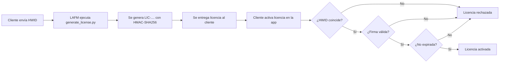
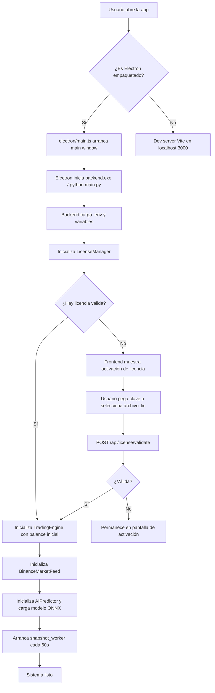
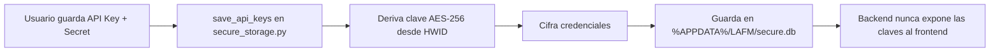
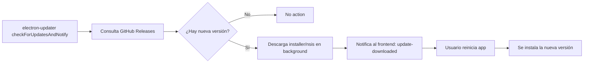
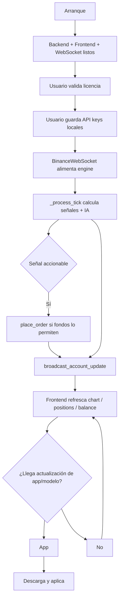

# LAFM Crypto Trading Terminal — Flujo del Sistema

> Documento vivo del flujo completo del sistema, desde la distribución de la licencia hasta la ejecución en producción.
> Generado el: 2026-07-27
> Versión: 1.0.1

---

## 1. Visión general

El sistema se compone de:

- **Frontend**: React + Vite (`frontend/`)
- **Backend**: FastAPI + Uvicorn (`backend/`)
- **Desktop wrapper**: Electron (`electron/`) — en producción empaqueta backend y frontend
- **Motor de IA**: ONNX Runtime (`ai_engine.py`)
- **Feed de mercado**: Binance WebSocket con fallback simulado (`market_feed.py`)
- **Almacenamiento seguro**: SQLite + AES-256-GCM + zeroize (`secure_storage.py`)
- **Gestión de licencias**: HMAC-SHA256 + HWID (`license_manager.py` + `scripts/generate_license.py`)
- **Actualizaciones**: `electron-updater` para la app y endpoint propio para el modelo ONNX
- **Deploy**: scripts PowerShell (`scripts/deploy.ps1`)
- **CI/CD**: GitHub Actions security audit (`security_audit.yml`)

---

## 2. Flujo de distribución de licencias



### Detalles

1. El cliente ejecuta la app y el backend calcula el hardware id (HWID).
2. El HWID se compone de:
   - `platform.node()`
   - `platform.machine()`
   - `platform.processor()`
   - `uuid.getnode()`
   - Serial de la placa base (`wmic baseboard get serialnumber`)
   - ID del CPU (`wmic cpu get processorid`)
3. LAFM, con el secreto compartido `LICENSE_SECRET`, genera la licencia con `scripts/generate_license.py`.
4. La licencia codifica: `hwid`, `exp` (expiración ISO8601) y `sig` (HMAC-SHA256 de `hwid|exp`).
5. Se guarda como base64 troceada en `scripts/license.lic` y se entrega al cliente.

### Archivos involucrados

- `backend/license_manager.py`
- `scripts/generate_license.py`

---

## 3. Flujo de arranque e inicialización



### Detalles

1. `electron/main.js` crea la ventana con título `Crypto Trading Terminal - LAFM`.
2. Ejecuta el backend local en segundo plano intentando, por orden:
   - `resources/trading_app.exe` (PyInstaller one-file)
   - `backend/trading_app.exe`
   - `backend/main.py` vía `python`
3. El backend carga `.env` y construye `app.state.limiter`, `CORSMiddleware`, `SlowAPIMiddleware`.
4. El endpoint `/api/health` expone `{ status, license_valid }`.

### Archivos involucrados

- `electron/main.js`
- `backend/main.py`
- `backend/.env`

---

## 4. Flujo de validación de licencia (HTTP)

```mermaid
sequenceDiagram
    participant FE as Frontend
    participant BE as Backend
    LM as LicenseManager

    FE->>BE: OPTIONS /api/license/validate
    BE-->>FE: 200 + CORS headers

    FE->>BE: POST /api/license/validate { license_key }
    BE->>LM: validate(license_key)
    LM->>LM: Parsear payload base64
    LM->>LM: Verificar HWID, exp, HMAC-SHA256
    LM-->>BE: valid = true/false
    BE-->>FE: { valid, message }
```

### Detalles

- El preflight `OPTIONS` se responde con 200 y headers CORS.
- El POST está limitado a 5 solicitudes por minuto (`limiter.limit("5/minute")`).

### Archivos involucrados

- `backend/main.py`
- `backend/license_manager.py`

---

## 5. Flujo de feed de mercado y datos en vivo

```mermaid
flowchart TD
    A[market_feed.start()] --> B{¿WebSocket Binance OK?}
    B -->|Sí| C[_connect_and_listen /wss/stream]
    B -->|No| D[_fetch_historical_candles fallback]
    D --> E{¿Funciona REST?}
    E -->|Sí| F[Cargar velas históricas]
    E -->|No| G[Buffer vacío]
    C --> H[_run_websocket recibe msg]
    H --> I[_process_tick del TradingEngine]
    I --> J[_generate_signals] --> K[AI Predict]
    K --> L[_combine_signal_with_ai]
    L --> M[Resultado: BUY / SELL / NEUTRAL / STRONG_* + current_price + atr]
    M --> N[broadcast_market_data a WebSockets conectados]
```

### Detalles

- Símbolo y timeframe: `SYMBOL`, `TIMEFRAME` en `.env` (default `BTCUSDT` / `1m`).
- Si falla repetidamente, se activa simulación interna en `_run_simulation_fallback`.
- Cada tick actualiza posiciones abiertas y genera señales técnicas.
- La señal técnica se combina con la probabilidad de la IA:
  - `BUY` + `ai_prob > 0.65` → `STRONG_BUY`
  - `SELL` + `ai_prob < 0.35` → `STRONG_SELL`
  - Otros casos mantienen `BUY` / `SELL` / `NEUTRAL`
- `broadcast_market_data` envía `candle` + `signals` incluyendo `current_price` y `atr`.

### Archivos involucrados

- `backend/market_feed.py`
- `backend/trading_engine.py`
- `backend/ai_engine.py`

---

## 6. Flujo de ejecución de órdenes

```mermaid
sequenceDiagram
    participant FE as Frontend
    participant BE as Backend
    TE as TradingEngine

    FE->>BE: POST /api/trading/order { side, order_type, quantity, price, tp, sl }
    BE->>TE: place_order(...)
    TE->>TE: Validar fondos / margen / modo paper
    TE->>TE: Crear orden y posición asociada
    TE-->>BE: Orden creada
    BE-->>FE: { success, order }
```

### Detalles

- Soportados: `BUY`, `SELL`, `LIMIT`, `MARKET`.
- El TP/SL se evaluarán tick a tick en `update_positions()`.
- En `paper_mode` no se envían órdenes al exchange.

### Archivos involucrados

- `backend/trading_engine.py`
- `backend/main.py`

---

## 7. Flujo de almacenamiento seguro de API keys



### Detalles

- Cifrado: AES-256.
- Derivación de clave: `HMAC-SHA256(HWID, "LAFM-SECURE-KEY")` (ajustable en `secure_storage.py`).
- Las claves nunca abandonan la máquina local.

### Archivos involucrados

- `backend/secure_storage.py`

---

## 8. Flujo de actualizaciones

### 8.1 Actualización de la aplicación Electron



- Configurado en `electron/main.js` con `provider: 'github'`.
- El `owner`/`repo` actual son placeholders y deben reemplazarse por el repo real.

### 8.2 Actualización del modelo ONNX

```mermaid
flowchart LR
    A[LAFM publica modelo + manifest] --> B[Payload JSON con URL de descarga]
    B --> C[Frontend llama POST /api/model/update { download_url, version }]
    C --> D[Backend descarga bytes]
    D --> E[Guarda en %APPDATA%/LAFM/models/trading_model.onnx]
    E --> F[_load_model() recarga pesos y metadata]
    F --> G[Próximas predicciones usan modelo nuevo]
```

### Archivos involucrados

- `electron/main.js`
- `backend/main.py` (`/api/model/update`)
- `backend/ai_engine.py`

---

## 9. Flujo de deployment / instalación

```mermaid
flowchart TD
    A[scripts/deploy.ps1] --> B[Build frontend: npm run build]
    B --> C[PyInstaller empaqueta backend como trading_app.exe]
    C --> D[electron-builder empaqueta app + backend]
    D --> E[Genera instalador Windows (.exe / .nsis)]
    E --> F[Publica release en GitHub]
    F --> G[Clientes descargan instalador firmado]
```

### Archivos involucrados

- `scripts/deploy.ps1`
- `backend/trading_app.spec`
- `electron/` (config de builder)

---

## 10. Flujo de runtime completo (end-to-end)



---

## 11. Mapa de vulnerabilidades y puntos críticos

| Punto | Estado actual | Riesgo / Acción |
|---|---|---|
| `LICENSE_SECRET` | `changeme-production-secret` | **Alto**: reemplazar antes de producción |
| Feed Binance | WebSocket + fallback simulado | Medio: simulación puede enmascarar caídas |
| CORS | Orígenes locales permitidos | Bajo: en producción restringir a orígenes firmados |
| Auto-update repo | Placeholder (`lafm/crypto-trading-app`) | **Alto**: requiere repo real para que funcione |
| `active_connections` | Corregido | Resuelto |
| Rate limiting `slowapi` | Corregido a API actual | Resuelto |

---

## 12. Comandos útiles

```powershell
# Backend local (venv)
cd backend
.\venv\Scripts\python.exe -m uvicorn main:app --host 127.0.0.1 --port 8765

# Frontend dev
npm run dev:frontend

# Generar licencia para HWID actual
python scripts/generate_license.py 30

# Validar licencia manualmente
Invoke-RestMethod -Uri "http://127.0.0.1:8765/api/license/validate" -Method Post `
  -Body (@{license_key="LIC-..."} | ConvertTo-Json) -ContentType "application/json"

# Deploy producción
.\scripts\deploy.ps1
```

---

## 13. Próximos pasos para producción

1. Rotar `LICENSE_SECRET` y regenerar licencias.
2. Configurar repo real de GitHub Releases para auto-update.
3. Publicar build firmado y probar actualización real.
4. Revisar política de CORS para entornos productivos.
5. Evaluar si el fallback simulado debe ser auditable / logueado en producción.
